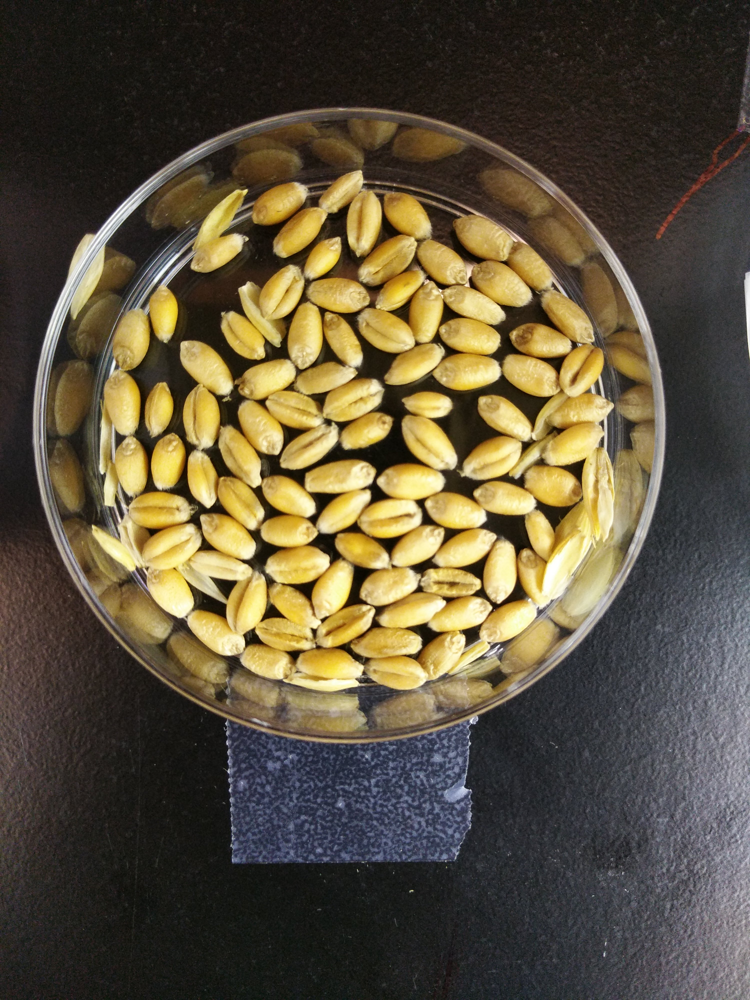

# 📘 Wheat Kernel FDK Detection and Analysis



## 🔍 Overview

This project provides a complete pipeline to **automatically detect**, **classify**, and **analyze wheat kernels** from image plates using a pre-trained YOLOv8 model. It is tailored to identify and quantify kernel traits such as:
- **Bleachness** (based on average RGB intensity)
- **Roughness** (based on standard deviation of RGB intensity)
- **Crease presence** (based on profile shape analysis)

The script performs **per-kernel analysis**, **per-plate summaries**, and generates **visualizations** for statistical interpretation across multiple images.

---

## 🗂️ Directory Structure

```
.
├── input_images/              # Folder with test JPG images of plates
├── output/                   # Auto-generated results
│   ├── images/               # Labeled images + kernel grid images
│   ├── individual_kernels_csv/ # CSV files for each plate (per-kernel data)
│   └── plate_level_summary.csv # Final summary: one row per plate
├── wheat_kernel_FDK_Detector.pt  # Trained YOLOv8 model
├── FDK Detection - Poster - Final.pdf  # Poster
└── README.md            # Full pipeline script (this code)
```

---

## ⚙️ Setup Instructions

1. **Environment Requirements:**
- Create a conda environment: 
``` 
conda create -n cvml python=3.12
```
- Install pytorch:   https://pytorch.org/get-started/locally/ - I installed in Macbook pro M3.
```
pip3 install torch torchvision torchaudio
```
- Install jupyterlab: 
```
pip install jupyterlab
```
- Install opencv: 
```
pip install opencv-contrib-python
```
- Install ultralytics: 
```
pip install ultralytics
```
- Install roboflow: 
```
pip install roboflow==1.1.48
```

2. **Input Preparation:**
   - Place all `.jpg` or `.jpeg` plate images in the `input_images/` folder.
   - Make sure the model file `wheat_kernel_FDK_Detector.pt` is placed in the project root.

---

## 🚀 How It Works

1. **Object Detection with YOLOv8:**
   - Kernels are detected and segmented from each image using a confidence threshold of `0.90`.

2. **Image Masking and Cropping:**
   - Each detected kernel is isolated using polygon masks and cropped for analysis.

3. **Kernel Rotation:**
   - Kernels are aligned horizontally using ellipse fitting to normalize their orientation.

4. **Crease Classification:**
   - Each rotated kernel is classified as **With Crease** or **Without Crease** based on profile length ratio using a smoothed horizontal intensity scan.

5. **RGB-Based Feature Extraction:**
   - For each kernel:
     - **Average Intensity** (proxy for bleachness)
     - **Standard Deviation** (proxy for roughness)
   - Values are rounded and stored for CSV output.

6. **CSV Outputs:**
   - A `.csv` file for **each plate** (`individual_kernels_csv/`) containing per-kernel stats.
   - A **combined summary** `plate_level_summary.csv` with average metrics for each plate.

7. **Visual Outputs:**
   - Annotated plate images with numbered kernels
   - Grid images of crease vs non-crease kernels

8. **Statistical Histograms:**
   - Plots generated:
     - % of bleached kernels
     - % of rough kernels
     - % of non-crease kernels
     - Total kernel count per plate

---

## 📊 Output Description

### Per-Kernel CSV (one per plate):
| Plate_Name | Kernel_ID | Average_Intensity | Std_Intensity |
|------------|-----------|-------------------|----------------|
| example1   | 1         | 135               | 48             |

### Summary CSV:
| Plate_Name | Average_Intensity | Std_Intensity | Total_Kernels |
|------------|-------------------|----------------|----------------|
| example1   | 132.5             | 47.3           | 104            |

---

## 🧪 Threshold Parameters

- **Average Intensity Threshold:** `180` – Determines % of bleached kernels
- **Standard Deviation Threshold:** `65` – Determines % of rough kernels
- These thresholds can be adjusted via:
```python
THRESHOLD_AVG_INTENSITY = 180
THRESHOLD_STD_INTENSITY = 65
```

---

## 📈 Visualization

The script generates histograms showing:
- Distribution of bleachness across plates
- Distribution of roughness
- Kernel crease frequency
- Kernel counts per plate

Use these plots to understand phenotypic variability and detect outliers.

---

## 📞 Contact

Prof. Jessica Rutkoski | jrut@illinois.edu

Prof, Sunoj Shajahan | sunoj@illinois.edu

Seung Wook Yoon | alexyoon9941@gmail.com, swyoon3@illinois.edu
